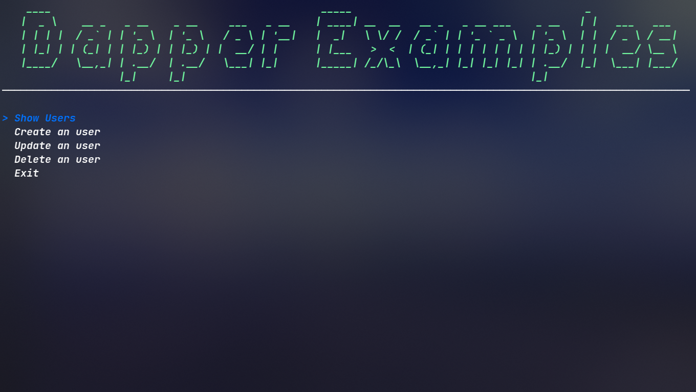

<h1 align="center">Dapper Training</h1>

 

Just an console app built with <a href="https://spectreconsole.net/">SpectreConsole</a> as an way 
to learn how to use Dapper with sqlite as the database.

## To run the Project

### 1- clone the repository

    git clone https://github.com/CaioCDJ/dapperSqlite.git

<h4 align="center">OR</h4>

    git clone git@github.com:CaioCDJ/dapperSqlite.git
### 2 - restore the project 

    dotnet restore

### 3 - Run the project

    dotnet run
